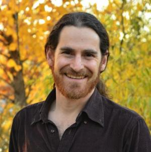
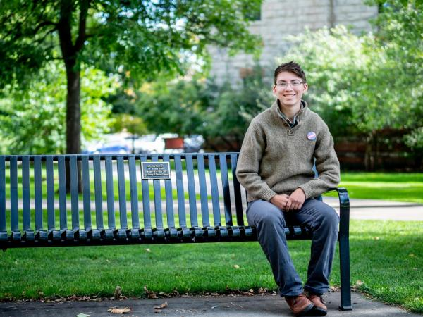

## Who we are

[Eyal Rivlin](https://www.colorado.edu/jewishstudies/faculty-and-staff/faculty/eyal-rivlin) (he/him/his) is an instructor in the Jewish Studies Program at the University of Colorado Boulder, as well as a musician and love warrior. 

Lior Gross (they/them/theirs) is a Bachelor's/Master's of the Arts candidate in the CU Boulder Ecology and Evolutionary Biology Department who applies their knowledge of ecology as a framework for justice through building critical community connections and fostering diversity for resilience through education.

## Our Story
When Lior enrolled to take Eyal's Hebrew class, it became apparent that it would be difficult for them to participate fully due to the binary nature of the language. As such, the two of us worked together to develop these systematics to address a community need. This tool has been eagerly received and we hope it can be helpful for your community too.
